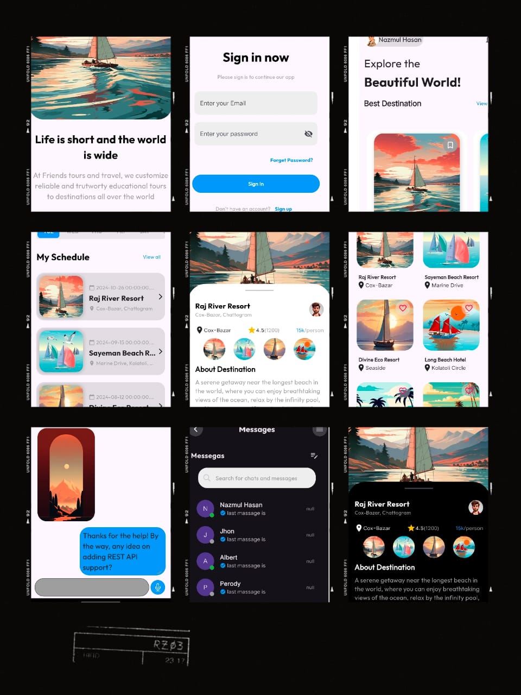

# Travel Mobile - Adventure at Your Fingertips 🌍

**Travel Mobile** is a beautifully designed Flutter application that allows users to explore and book adventure destinations, hotels, and other exciting travel options. With a clean, intuitive interface, users can easily navigate through travel options, view destination details, and plan their dream trips. State management is implemented using GetX for a smooth and responsive user experience.



## Features
- **Explore Destinations:** Browse through a curated list of adventure destinations and discover beautiful places to visit.
- **Hotel & Stay Options:** Find suitable accommodations based on your chosen destination.
- **Detailed Descriptions:** Get in-depth information about each location, including amenities, nearby attractions, and travel tips.
- **Seamless User Experience:** State management using GetX ensures a smooth, responsive interface.
- **Dark & Light Theme Support:** Switch between themes to suit your preference.

## Installation

1. **Clone the Repository**
   ```bash
   git clone https://github.com/yourusername/TravelMobile.git
   cd TravelMobile
